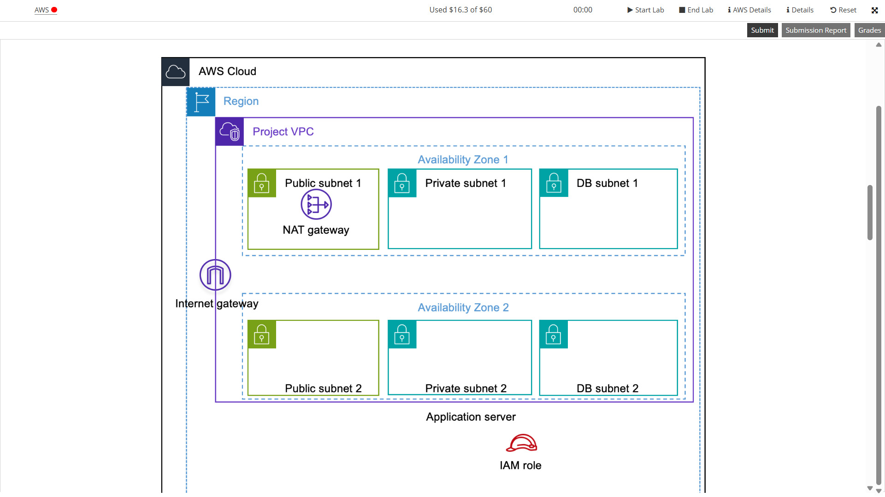
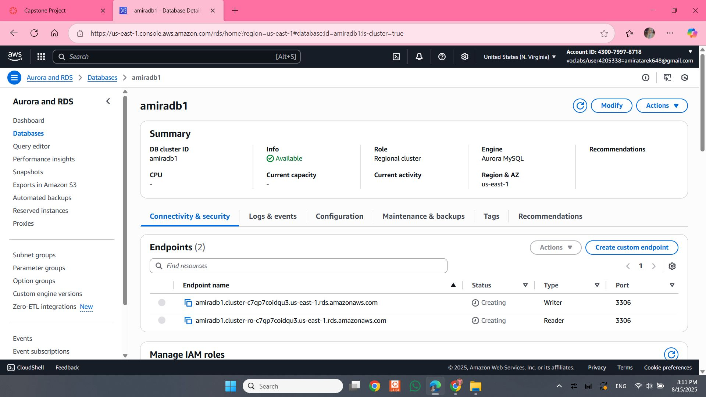
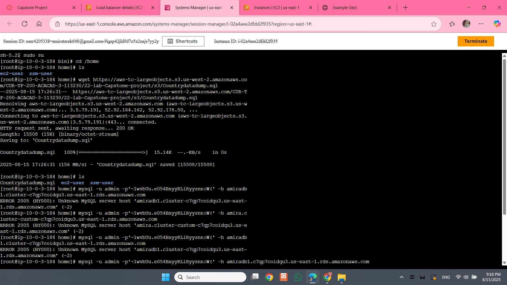
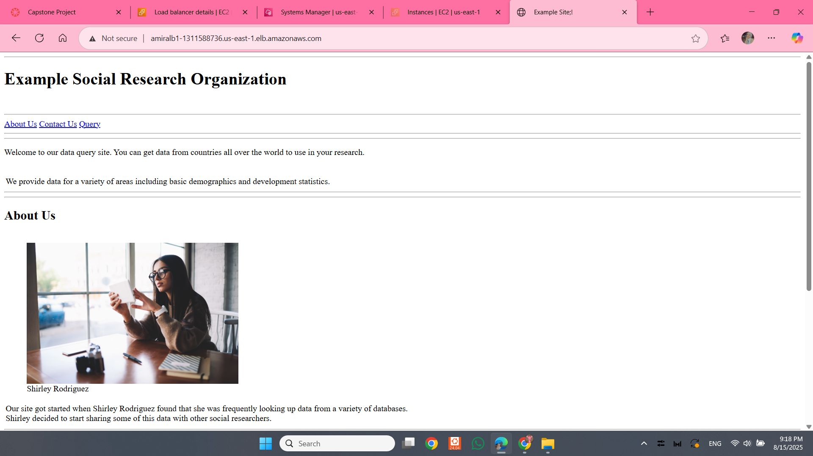
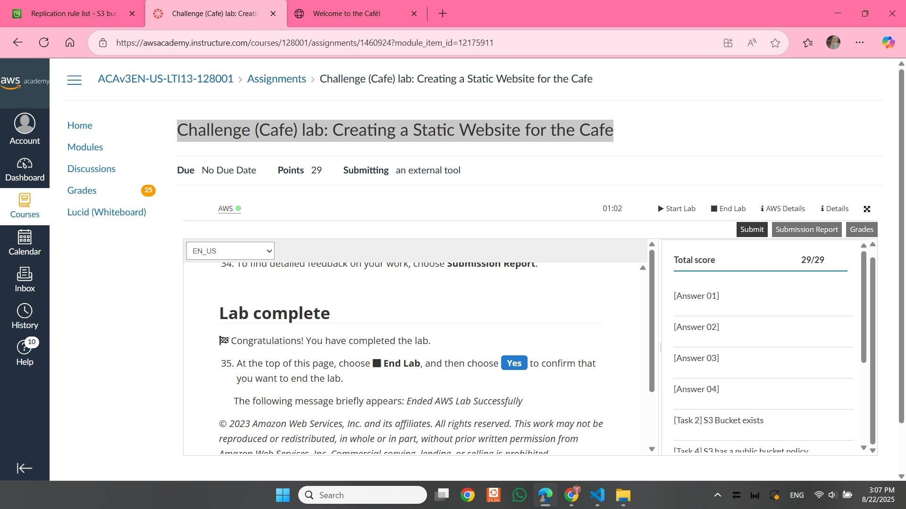

# AWS Academy Cloud Architecting – Capstone Project

This repository documents my work on the **Capstone Project** for the **AWS Academy Cloud Architecting** course.  
The project demonstrates how to design and deploy a **highly available, fault-tolerant, and secure PHP web application** backed by a MySQL database in AWS.

---

## 📌 Overview and Objectives
The main objectives of this project were to apply architectural design principles learned in the course to:

- Create a secure and managed **Amazon RDS MySQL database**.
- Deploy a **highly available PHP application** distributed across multiple Availability Zones.
- Configure an **Application Load Balancer** to distribute incoming traffic.
- Implement **Auto Scaling** for fault tolerance and elasticity.
- Use **AWS Secrets Manager** to securely store database credentials.
- Import data from a SQL dump into the RDS database.
- Restrict access to ensure application servers and backend systems are secure.

---

## 🏗️ Architecture
The solution follows AWS best practices for scalability, availability, and security:

- **VPC** with public and private subnets across multiple Availability Zones.
- **Application Load Balancer (ALB)** in public subnets to provide anonymous user access.
- **EC2 instances** (t2.micro) deployed in private subnets via an Auto Scaling Group.
- **Amazon RDS MySQL** instance deployed in private subnets for persistent storage.
- **AWS Secrets Manager** for secure database credential storage.
- **IAM Roles** to enable least-privilege access for services.

### Architecture Diagram 

---

## ⚙️ Implementation Steps

### 1. Create Amazon RDS MySQL Database
- Provisioned an RDS instance using the pre-created subnet group.
- Restricted database access to only application servers.
- Stored DB username and password in **AWS Secrets Manager**.
- Initial database created as **`countries`**.

📸 Screenshot:  

---

### 2. Configure Application Load Balancer
- Deployed an **Application Load Balancer (ALB)** in public subnets across at least two Availability Zones.
- Registered target group for backend EC2 instances.
- Used the ALB DNS name as the public entry point for the web app.

---

### 3. Deploy Application Servers with Auto Scaling
- Created a **launch template** based on the provided `Example-LT`.
- Configured an **Auto Scaling Group** to deploy multiple EC2 instances in private subnets.
- Attached the Auto Scaling Group to the Application Load Balancer.
- Target tracking policy configured for CPU utilization.

📸 Screenshot:  

---

### 4. Import Data into RDS
- Imported SQL dump file into the `countries` database.
- Connected securely using credentials retrieved from **AWS Secrets Manager**.
- Verified data import by running queries.

---

### 5. Test the Application
- Accessed the PHP web app via the Load Balancer DNS name.
- Queried the database successfully through the web interface.
- Verified data integrity and functionality.

📸 Screenshot:  

---

## 🔒 Security Considerations
- EC2 instances hosted in **private subnets** (no direct public access).
- Access to the database restricted to application servers only.
- Sensitive credentials managed with **AWS Secrets Manager**.
- IAM roles used to grant services only the permissions they require.

---

## 📚 Lessons Learned and Final Grade
- Designing for **high availability** requires careful subnet and AZ planning.
- **Secrets Manager** greatly simplifies credential rotation and security.
- **Auto Scaling** ensures elasticity while keeping costs manageable.
- The separation of **public and private subnets** improves security posture.

---

